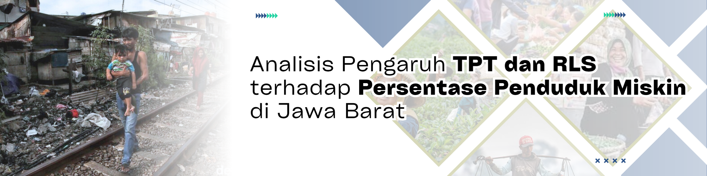
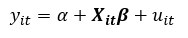
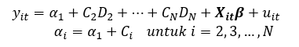
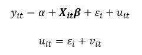

### 📘 **Pendahuluan**

---

Proyek ini merupakan analisis data panel (2021-2024) untuk menguji dampak pengangguran (TPT) dan pendidikan (RLS) terhadap tingkat kemiskinan di 27 kabupaten/kota di Jawa Barat.

### 📖 **Latar Belakang**

---

Jawa Barat menghadirkan suatu anomali. sebagai lumbung industri dan populasi terbesar, **kemiskinan** tetap menjadi **masalah kronis**. Kebijakan publik secara tradisional berfokus pada dua pilar untuk mengatasinya, yaitu menurunkan **Tingkat Pengangguran Terbuka (TPT)** dan **meningkatkan Rata-rata Lama Sekolah (RLS)**. Namun, efektivitas kedua pilar ini dipertanyakan. Fokus pada TPT berisiko mengabaikan fenomena pekerja miskin yang **memiliki pekerjaan** namun **upahnya tidak mencukupi**, sementara fokus pada RLS dihadapkan pada realitas ketidakcocokan struktural di mana **lulusan terdidik tidak selalu terserap oleh pasar kerja yang ada**.

Proyek ini tidak bertujuan untuk membuktikan ulang teori, melainkan untuk menguji efektivitas kuantitatif dari kedua pilar kebijakan tersebut. Dengan menggunakan data panel 2021-2024 dari 27 kabupaten/kota di Jawa Barat, penelitian ini mencari jawaban yang lebih mendalam. Di antara ketersediaan lapangan kerja (TPT) dan kualitas modal manusia (RLS), **pengungkit manakah** yang secara statistik memiliki dampak **paling signifikan** dalam menurunkan **kemiskinan di Jawa Barat** pada periode pemulihan ekonomi saat ini?

### 🎯 **Tujuan Proyek**

---

Berdasarkan latar belakang tersebut, tujuan dari proyek ini adalah:

1. Menganalisis pengaruh **Tingkat Pengangguran Terbuka (TPT)** secara **parsial** terhadap **Persentase Penduduk Miskin (PPM)** di kabupaten/kota Jawa Barat.
2. Menganalisis pengaruh **Rata-Rata Lama Sekolah (RLS)** secara **parsial** terhadap **Persentase Penduduk Miskin (PPM)** di kabupaten/kota Jawa Barat.
3. Menganalisis pengaruh **TPT dan RLS** secara **simultan (bersama-sama)** terhadap **Persentase Penduduk Miskin (PPM)** di kabupaten/kota Jawa Barat.
4. Mengidentifikasi faktor (**antara TPT dan RLS**) yang memiliki pengaruh **paling dominan** terhadap **Persentase Penduduk Miskin (PPM)** di Jawa Barat selama periode 2021-2024.

### 📊 **Data & Variabel**

---

  

 

  <table style="border: none; border-collapse: collapse;">
  <tr style="border: none;">
    <td style="border: none;" valign="top">
      <h4>🔢 <em>Variabel Prediktor (X)</em></h4>
      <ul>
        <li>Tingkat Pengangguran Terbuka (TPT)</li>
        <li>Rata-Rata Lama Sekolah (RLS)</li>
      </ul>
    </td>
    <td style="border: none;" width="50px">&nbsp;</td>
    <td style="border: none;" valign="top">
      <h4>📈 <em>Variabel Target (Y)</em></h4>
      <ul>
        <li>Persentase Penduduk Miskin (PPM)</li>
      </ul>
    </td>
  </tr>
  </table>

### 📦 **Ruang Lingkup**

---

1. **Cakupan**: Penelitian ini menggunakan **data panel tahunan** yang terdiri dari **27 Kabupaten/Kota di Provinsi Jawa Barat** (sebagai *unit cross-section*) selama periode waktu 2021-2024.

2. **Fokus**: Berfokus pada pemodelan hubungan pengaruh secara langsung antara dua faktor utama (Tingkat Pengangguran Terbuka dan Rata-Rata Lama Sekolah) terhadap Persentase Penduduk Miskin. Analisis mencakup pemilihan model regresi data panel (FEM/REM), pengujian asumsi klasik, dan penerapan koreksi model (*Driscoll-Kraay Standard Errors*) untuk mengukur kekuatan dan arah hubungan.

3. **Batasan**: Penelitian ini tidak mencakup faktor-faktor eksternal lain yang secara teoretis dapat memengaruhi kemiskinan (misalnya, inflasi, Gini Ratio, pertumbuhan PDRB, atau belanja bantuan sosial pemerintah) di luar dua variabel independen yang telah dipilih.

### 🧭 **Metodologi**

---

#### **1. 🧹 Persiapan Data (*Data Wrangling*)**

---

- **Pengumpulan Data**: Mengumpulkan data sekunder data panel (tahunan 2021-2024) dari Badan Pusat Statistik (BPS) Jawa Barat.
- **Cakupan Data**: Data mencakup 3 variabel (`PPM`, `TPT`, `RLS`) untuk 27 Kabupaten/Kota di Jawa Barat dengan rentang waktu 2021 s.d. 2024 (`N=27`, `T=4`, `Total Observasi=108`).
- **Pembersihan & Konsistensi**:

  - Memastikan semua variabel telah diformat sebagai numerik (`<dbl>`) menggunakan `glimpse()`.
  - Menggabungkan (`merge`) dataset yang terpisah menjadi satu data frame panel akhir yang seimbang (*balanced panel*).
  

  
   
  <em>Gambar 1. Cuplikan Data</em>

 

<table style="border-collapse: collapse; width: 80%;">
  <tr>
    <th style="width: 5%;">No</th>
    <th style="width: 20%;">Wilayah</th>
    <th style="width: 10%;">Tahun</th>
    <th style="width: 10%;">TPT</th>
    <th style="width: 10%;">RLS</th>
    <th style="width: 10%;">PPM</th>
  </tr>
  <tr>
    <td>1</td>
    <td>Bandung</td>
    <td>2024</td>
    <td>6.36</td>
    <td>9.15</td>
    <td>6.19</td>
  </tr>
  <tr>
    <td>2</td>
    <td>Bandung</td>
    <td>2023</td>
    <td>6.52</td>
    <td>9.10</td>
    <td>6.40</td>
  </tr>
  <tr>
    <td>3</td>
    <td>Bandung</td>
    <td>2022</td>
    <td>6.98</td>
    <td>9.08</td>
    <td>6.80</td>
  </tr>
  <tr>
    <td>4</td>
    <td>Bandung</td>
    <td>2021</td>
    <td>8.32</td>
    <td>9.07</td>
    <td>7.15</td>
  </tr>
  <tr>
    <td>5</td>
    <td>Bandung Barat</td>
    <td>2024</td>
    <td>6.70</td>
    <td>8.24</td>
    <td>10.50</td>
  </tr>
  <tr>
    <td>6</td>
    <td>Bandung Barat</td>
    <td>2023</td>
    <td>8.11</td>
    <td>8.23</td>
    <td>10.52</td>
  </tr>
  <tr>
    <td>...</td>
    <td>...</td>
    <td>...</td>
    <td>...</td>
    <td>...</td>
    <td>...</td>
  </tr>
    <tr>
    <td>103</td>
    <td>Sumedang</td>
    <td>2022</td>
    <td>7.72</td>
    <td>8.72</td>
    <td>10.14</td>
  </tr>
  <tr>
    <td>104</td>
    <td>Sumedang</td>
    <td>2021</td>
    <td>9.18</td>
    <td>8.52</td>
    <td>10.71</td>
  </tr>
  <tr>
    <td>105</td>
    <td>Tasikmalaya</td>
    <td>2024</td>
    <td>3.74</td>
    <td>7.97</td>
    <td>10.23</td>
  </tr>
  <tr>
    <td>106</td>
    <td>Tasikmalaya</td>
    <td>2023</td>
    <td>3.89</td>
    <td>7.96</td>
    <td>10.28</td>
  </tr>
  <tr>
    <td>107</td>
    <td>Tasikmalaya</td>
    <td>2022</td>
    <td>4.17</td>
    <td>7.73</td>
    <td>10.73</td>
  </tr>
  <tr>
    <td>108</td>
    <td>Tasikmalaya</td>
    <td>2021</td>
    <td>6.16</td>
    <td>7.48</td>
    <td>11.15</td>
  </tr>
</table>

#### **2. 🔍 Analisis Data Eksplorasi (EDA)**

---
Tahap ini bertujuan untuk memahami karakteristik data, mengidentifikasi pola distribusi, serta mendeteksi struktur data panel (variasi antar-waktu dan antar-wilayah) sebelum dilakukan estimasi model regresi.

Langkah awal melibatkan pemeriksaan statistik deskriptif untuk melihat nilai rata-rata dan sebaran data secara keseluruhan (*n=108*).

  
   
  <em>Gambar 2.1 Ringkasan Statistik Deskriptif (Keseluruhan)</em>

 

    

> * **Kemiskinan (PPM):** Rata-rata PPM di Jawa Barat adalah **8.45%**.
> * **Pendidikan (RLS):** Rata-rata lama sekolah adalah **8.81 tahun** (setara kelas 2-3 SMP).
> * **Pengangguran (TPT):** Rata-rata tingkat pengangguran terbuka sebesar **7.73%**.

Untuk memahami bentuk data lebih dalam, dilakukan visualisasi distribusi:

  
   
  <em>Gambar 2.2 Histogram dan Plot Densitas Variabel</em>

 

    
     
      
> * **PPM (Kemiskinan):** Distribusi cenderung **bimodal** (memiliki dua puncak). Ini mengindikasikan adanya pengelompokan wilayah yang kontras: kelompok wilayah dengan kemiskinan rendah (umumnya Kota) dan kelompok dengan kemiskinan tinggi (umumnya Kabupaten).
> * **TPT (Pengangguran):** Distribusi sedikit menceng ke kiri (*skewed*), menunjukkan mayoritas wilayah memiliki tingkat pengangguran di sekitar rata-rata, namun terdapat beberapa wilayah dengan angka ekstrem (outlier).

#### **2.1 Analisis Hubungan Antar Variabel**
Analisis ini memvisualisasikan hubungan antara variabel dependen (PPM) dengan variabel independen (TPT dan RLS) untuk melihat korelasi awal.
#### **A. Visualisasi Scatter Plot (Pola Hubungan)**

  
   
  <em>Gambar 2.3 Scatter Plot RLS vs PPM</em>

 

    

      

  
   
  <em>Gambar 2.4 Scatter Plot TPT vc PPM</em>

 

    

> 1.  **RLS vs PPM:** Terdapat hubungan **negatif**. Semakin tinggi rata-rata lama sekolah, tingkat kemiskinan cenderung semakin rendah.

> 2.  **TPT vs PPM:** Hubungan terlihat lebih variatif, namun tetap menunjukkan pola tertentu yang perlu diuji lebih lanjut dalam model.

#### **B. Matriks Korelasi Pearson**
- **Uji Korelasi Pearson**: Membuat matriks korelasi untuk mengukur kekuatan dan arah hubungan linear awal antar variabel, serta sebagai deteksi dini risiko multikolinearitas.

  
   
  <em>Gambar 2.4 Heatmap Matriks Korelasi</em>

 

  <blockquote style="font-size: 14px; color: rgba(0,0,0,0.95);">
    

      Berdasarkan hasil dari heatmap matriks korelasi, teridentifikasi sebuah 
      <strong>korelasi negatif yang kuat</strong> antara 
      <code>PPM</code> (Kemiskinan) dan <code>RLS</code> (Pendidikan) 
      (<strong>-0.73</strong>), yang mengindikasikan bahwa 
      <strong>pendidikan yang lebih tinggi</strong> sangat terkait dengan 
      <strong>kemiskinan yang lebih rendah</strong>.
    

    

      Namun, hubungan yang lebih kompleks terlihat pada variabel lain. 
      Ditemukan <strong>korelasi negatif yang sangat lemah (-0.18)</strong> 
      antara <code>PPM</code> dan <code>TPT</code> (Pengangguran), yang kemungkinan 
      disebabkan oleh fenomena "pekerja miskin" (<em>working poor</em>) 
      yang <strong>tidak terhitung sebagai penganggur (TPT) namun tetap miskin</strong>.
    

    

      Selain itu, <strong>korelasi positif lemah (0.31)</strong> antara 
      <code>TPT</code> dan <code>RLS</code> mengindikasikan adanya 
      <em>mismatch</em> di pasar kerja, di mana 
      <strong>lulusan yang lebih terdidik</strong> mungkin 
      <strong>secara selektif menganggur</strong> sambil menunggu 
      <strong>pekerjaan yang layak</strong>.
    

  </blockquote>

#### **2.3 Struktur Data Panel (Heterogenitas)**
Bagian ini adalah **inti dari eksplorasi data panel**, bertujuan untuk memvalidasi apakah terdapat karakteristik unik antar wilayah (*individual heterogeneity*) yang tidak bisa ditangkap oleh regresi biasa.
#### **A. Tren Waktu (*Within-Group Variation*)**

  
   
  <em>Gambar 2.5 Spaghetti Plot Tren Kemiskinan per Wilayah (2021-2024)</em>

 

    

> Spaghetti plot menunjukkan bahwa hampir seluruh wilayah mengalami tren penurunan kemiskinan dari tahun 2021 ke 2024 (kemiringan garis menurun). Namun, garis-garis tersebut tidak berimpit, melainkan terpisah pada level (intercept) yang berbeda-beda. Ini menunjukkan bahwa meskipun tren waktunya seragam, setiap wilayah memulai dari "titik start" kemiskinan yang berbeda.

#### B. Variasi Antar Wilayah (Between-Group Variation)

  
   
  <em>Gambar 2.6 Boxplot Distribusi PPM berdasarkan Wilayah</em>

 

    

> Boxplot di atas mengonfirmasi adanya **disparitas (ketimpangan) yang ekstrem** antar wilayah:

> - **Klaster Rendah:** Kota Depok, Kota Bandung, dan Kota Bekasi konsisten memiliki tingkat kemiskinan sangat rendah (< 5%).

> - **Klaster Tinggi:** Indramayu, Kuningan, dan Cirebon memiliki tingkat kemiskinan yang jauh lebih tinggi (> 12%).

**Kesimpulan Eksplorasi**
Adanya variasi antar-individu yang sangat besar (terlihat di Boxplot) dan perbedaan intercept yang konsisten (terlihat di Spaghetti Plot) memberikan justifikasi kuat bahwa metode **Regresi Linear Biasa (OLS) kemungkinan besar akan bias dan tidak efisien.**

Oleh karena itu, diperlukan metode **Regresi Data Panel** (seperti Fixed Effect atau Random Effect) untuk menangkap efek heterogenitas wilayah tersebut secara akurat.

#### **3. 📚 Konsep Dasar Regresi Data Panel**

---
**A. Pengertian Regresi Data Panel**

Regresi data panel adalah metode analisis regresi yang diterapkan pada data yang berstruktur panel, yaitu data yang menggabungkan karakteristik data deret waktu (<em>time series</em>) dan data silang (<em>cross section</em>). Secara umum, bentuk persamaan regresi data panel sebagai berikut:

  

dimana i = 1, 2, …, N dan t = 1, 2, …, T dengan i unit lintas individu, t unit deret waktu, α koefisien konstanta, β vektor berukuran k × 1 dengan k menyatakan banyaknya peubah bebas. yit peubah respon untuk individu ke-i periode waktu ke-t, Xit individu ke-i periode waktu ke-t pada peubah bebas ke-k, dan uit adalah sisaan/error pada individu ke-i periode waktu ke-t.

**B. Metode Pendugaan Model Regresi Data Panel**
  
  1. Model Gabungan (<em>Common Effect Model</em>)
  
  Model gabungan adalah model yang menyamakan seluruh koefisien untuk semua individu dan waktu, sehingga bersifat seperti regresi linier biasa tanpa mempertimbangkan pengaruh individu maupun waktu. Bentuk persamaan model gabungan sebagai berikut:
  

  

 
  2. Model Pengaruh Tetap (<em>Fixed Effect Model</em>)
  
 Model pengaruh tetap adalah model dengan slope konstan dan intercept berbeda antar individu, yang diduga menggunakan metode LSDV dengan membentuk N−1 peubah dummy. Bentuk persamaan model pengaruh tetap sebagai berikut:
  

  

  
  3. Model Pengaruh Acak (<em>Random Effect Model</em>)
  
 Model pengaruh acak adalah model panel yang memandang efek individu sebagai komponen acak dalam sisaan, tidak menggunakan dummy seperti Ficed Effect, dan diduga dengan GLS karena OLS menjadi bias dan tidak efisien. Bentuk persamaan model pengaruh acak sebagai berikut:
  

  

**C. Uji Pemilihan Model Regresi Data Panel**

Uji pemilihan model pada regresi data panel perlu dilakukan untuk menentukan model mana yang paling tepat digunakan, apakah <em>common effect model</em>, <em>fixed effect model</em>, atau <em>random effect model</em>. Berikut ini merupakan rangkaian uji pemilihan model yang dilakukan.

  1. **Uji Chow** merupakan pengujian hipotesis antara **model gabungan** dan **model pengaruh tetap** untuk menentukan model yang tepat dalam mengestimasi data panel. 

  2. **Uji Hausman** merupakan pengujian hipotesis antara **model pengaruh acak** dan **model pengaruh tetap** untuk menentukan model yang tepat dalam mengestimasi data panel. 

  3. **Uji Lagrange Multipler** merupakan pengujian hipotesis antara **model gabungan** dan **model pengaruh acak** untuk menentukan model yang tepat dalam mengestimasi data panel. Dilakukannya uji lagrange multiplier karena pada uji chow terpilih model pengaruh tetap, namun pada uji hausman terpilih model pengaruh acak. Sehingga untuk memutuskan model yang akan digunakan maka dilakukan Uji Lagrange Multiplier.
     
**D. Uji Signifikansi Parameter**

1. **Uji F (Uji Simultan)** digunakan untuk mengetahui semua variabel independen secara bersama-sama mempunyai pengaruh terhadap variabel dependen. 

2. **Uji t (Uji Parsial)** digunakan untuk mengetahui pengaruh setiap variabel independen dan variabel dependen. 

3. **Koefisien Determinasi (R^2)** merupakan cerminan seberapa besar variasi dari variabel dependen dapat dijelaskan oleh variabel independen. Ditentukan oleh R^2 yang mempunyai nilai di antara nol dan satu.

**E. Uji Asumsi Regresi Data Panel**

Uji asumsi klasik pada regresi data panel mencakup beberapa pemeriksaan, seperti:

1. Pengecekan normalitas

2. Pendeteksian multikolinearitas

3. Pengujian heteroskedastisitas

4. Pengujian autokorelasi.

#### **4. 🔧 Pemodelan Regresi Data Panel**

---

- **Formulasi Model**: Memodelkan `PPM` (Y) sebagai fungsi dari `TPT` (X1) dan `RLS` (X2) menggunakan paket `plm` di R.

  - Model Utama: PPM ~ TPT + RLS

- **Estimasi Model Awal**: Melakukan estimasi pada tiga model dasar regresi data panel untuk perbandingan:

  - *Common Effect Model* (Pooled OLS)
  

    
   
    <em>Gambar 4.1. Persamaan Regresi Common Model</em>
  

   
  
  - *Fixed Effect Model* (FEM)
  

    
   
    <em>Gambar 4.2. Persamaan Regresi Fixed Model</em>
  

   
  
  - *Random Effect Model* (REM)
  

    
   
    <em>Gambar 4.3. Persamaan Regresi Random Model</em>
  

    

<blockquote style="font-size: 14px; color: rgba(0,0,0,0.95);">

Berdasarkan hasil estimasi, ketiga model (<code>Pooled OLS</code>, <code>Fixed Effect</code>, dan <code>Random Effect</code>) ditemukan <strong>signifikan secara keseluruhan</strong>, yang ditunjukkan oleh nilai p-value F-statistik atau Chisq yang <strong>sangat kecil</strong> (<code>< 0.000...222</code>). Model <code>Pooled OLS</code> (<strong>R-sq: 0.54</strong>) mengindikasikan bahwa <code>RLS</code> (Rata-Rata Lama Sekolah) memiliki pengaruh negatif dan sangat signifikan terhadap kemiskinan. Namun, dalam model ini, variabel <code>TPT</code> (Tingkat Pengangguran Terbuka) ditemukan <strong>tidak signifikan</strong> secara statistik (<strong>p-value = 0.4608</strong>).

Sebaliknya, hasil yang berbeda ditunjukkan oleh kedua model panel. Dalam model <code>Fixed Effect</code> (<strong>R-sq: 0.64</strong>) maupun model <code>Random Effect</code> (<strong>R-sq: 0.61</strong>), kedua variabel independen (<code>TPT</code> dan <code>RLS</code>) ditemukan memiliki pengaruh yang <strong>sangat signifikan</strong> terhadap kemiskinan. Sesuai dengan teori, koefisien <code>TPT</code> teridentifikasi <strong>positif (menaikkan kemiskinan)</strong> dan koefisien <code>RLS</code> teridentifikasi <strong>negatif (menurunkan kemiskinan)</strong> pada kedua model panel tersebut. Perbedaan signifikansi <code>TPT</code> antara model <code>Pooled OLS</code> dan model panel ini menegaskan <strong>pentingnya memperhitungkan efek individu</strong> (heterogenitas) antar wilayah.

</blockquote>

  
#### **5. 🧩 Pemilihan Model & Uji Spesifikasi**

---

- **Pemilihan Model**: Menjalankan serangkaian uji spesifikasi untuk memilih model terbaik:

  - **Uji Chow (pFtest)**: Memilih antara *Common Effect* vs *Fixed Effect*.

     Didapatkan nilai p-value dari Uji Chow sebesar 0.0000022 < 0.05 artinya tolak H0, sehingga model Common Effect dan data memiliki efek individual, sehingga Pooled OLS tidak sesuai.
  
  - **Uji Lagrange Multiplier (plmtest)**: Memilih antara *Common Effect* vs *Random Effect*.

    Didapatkan nilai p-value dari Uji Lagrange Multiplier sebesar 0.0000022 < 0.05 artinya tolak H0, sehingga model Common Effect ditolak, dan model dengan efek (Fixed Effect/Random Effect) lebih tepat digunakan.

  - **Uji Hausman (phtest)**: Memilih antara *Fixed Effect* vs *Random Effect*.

    Didapatkan nilai p-value dari Uji Hausman sebesar 0.6014 > 0.05 artinya gagal tolak H0, sehingga Random Effect diterima sebagai model yang lebih konsisten dan efisien dibanding Fixed Effect.

</blockquote>

#### **6. 📐 Validasi Model & Uji Asumsi Klasik** 

---

- **Diagnostik**: Memvalidasi keandalan statistik model `REM` yang terpilih.

  - **Multikolinearitas**: Menggunakan `vif()` pada model OLS Pooled (VIF < 10).
    
    | Variabel | Nilai    |
    |----------|----------:|
    | TPT      | 1.107534 |
    | RLS      | 1.107534 |

  - **Normalitas Residual**: Menggunakan `shapiro.test()` (p-value > 0.05).
  
    | Statistik   | Nilai    |
    |---------- |----------:|
    | W       | 0.9361 |
    | p-value       | 0.00005941 |

  - **Heteroskedastisitas**: Menggunakan `bptest()` (p-value > 0.05).
    
    | Statistik | Nilai     |
    |-----------|-----------:|
    | BP        | 0.52038   |
    | df        | 2         |
    | p-value   | 0.7709    |

  - **Autokorelasi**: Menggunakan `pdwtest()` (Durbin-Watson panel) (p-value > 0.05).

    | Statistik | Nilai    |
    |----------|----------:|
    | DW      | 1.518 |
    | p-value      | 0.005124 |

  - **Cross-Sectional Dependence (CSD)**: Menggunakan `pcdtest()` (Pesaran CD) (p-value > 0.05).
  
    | Statistik | Nilai    |
    |----------|----------:|
    | Z      | 5.7725 |
    | p-value      | 0.000000007812 |
 

   
<blockquote style="font-size: 14px; color: rgba(0,0,0,0.95);">

Berikut adalah interpretasi ringkas dari hasil uji asumsi klasik yang disajikan:

<ul>
  <li style="margin-bottom: 10px;">
<strong>Uji Multikolinearitas (VIF)</strong> 
Nilai VIF (Variance Inflation Factor) untuk kedua variabel independen (<code>TPT</code> dan <code>RLS</code>) tercatat sebesar <strong>1.107534</strong>. Karena nilai ini <strong>jauh di bawah ambang batas umum (5 atau 10)</strong>, dapat disimpulkan bahwa <strong>tidak terdeteksi adanya masalah multikolinearitas</strong> antar variabel independen dalam model.
  </li>
  <li style="margin-bottom: 10px;">
<strong>Uji Normalitas (Shapiro-Wilk)</strong> 
Diperoleh nilai p-value sebesar <strong>0.00005941</strong>, yang jauh <strong>lebih kecil dari tingkat signifikansi 0.05</strong>. Oleh karena itu, <strong>H0 (residual terdistribusi normal) ditolak</strong>. Ini mengindikasikan bahwa <strong>asumsi normalitas residual telah dilanggar</strong>.
  </li>
  <li style="margin-bottom: 10px;">
<strong>Uji Homokedastisitas (Breusch-Pagan)</strong> 
Nilai p-value yang dihasilkan adalah <strong>0.7709</strong>. Karena nilai ini secara signifikan <strong>lebih besar dari 0.05</strong>, maka <strong>H0 (terdapat homoskedastisitas atau varians error konstan) gagal ditolak</strong>. Dapat disimpulkan bahwa <strong>tidak ditemukan adanya masalah heteroskedastisitas</strong> dalam model.
  </li>
  <li style="margin-bottom: 10px;">
<strong>Uji Autokorelasi (Durbin-Watson)</strong> 
Dari hasil <code>pdwtest</code>, didapatkan p-value sebesar <strong>0.005124</strong>, yang <strong>lebih kecil dari 0.05</strong>. Dengan demikian, <strong>H0 (tidak ada autokorelasi serial) ditolak</strong>. Ini menunjukkan bahwa telah <strong>terdeteksi adanya masalah autokorelasi serial</strong> dalam model.
  </li>
  <li style="margin-bottom: 10px;">
<strong>Uji Cross-sectional Dependence (Pesaran CD)</strong> 
Dari hasil <code>Uji Pesaran CD</code>, diperoleh <code>p-value</code> yang <strong>sangat kecil</strong> (<strong>0.000000007812</strong>), yang secara signifikan <strong>lebih rendah dari 0.05</strong>. Oleh karena itu, <strong><code>H0</code> (tidak ada cross-sectional dependence) ditolak</strong>. Ini mengindikasikan bahwa telah <strong>terdeteksi adanya masalah ketergantungan lintas-seksi (cross-sectional dependence)</strong> yang signifikan dalam data panel. Artinya, terdapat <strong>"efek tular" (spillover)</strong> atau korelasi antar galat (error) dari satu kabupaten/kota ke kabupaten/kota lainnya.
  </li>
</ul>
</blockquote>

#### **7. 🩺 Remediasi Model (Perbaikan Model)**  

---

- **Diagnosis**: Hasil dari Uji Asumsi (Langkah 5) menunjukkan adanya pelanggaran asumsi **Normalitas**, **Autokorelasi** dan **Cross-Sectional Dependence (CSD)** yang signifikan.

<blockquote style="font-size: 14px; color: rgba(0,0,0,0.95);">

<ul style="list-style-type: decimal; margin-left: 20px;">
  <li style="margin-bottom: 10px;">
<strong>Gagal Uji Normalitas (Pelanggaran Ringan)</strong>: Pelanggaran asumsi ini dianggap ringan karena jumlah observasi yang besar (<code>N*T = 108</code>). Berkat <strong>Central Limit Theorem (CLT)</strong>, estimasi koefisien tetap dapat diandalkan.
  </li>
  <li style="margin-bottom: 10px;">
<strong>Gagal Uji Autokorelasi (Pelanggaran Serius)</strong>: Ini membuktikan adanya <strong>"efek kelembaman" (<em>persistence</em>)</strong>, di mana galat (<em>error</em>) dari tahun sebelumnya "bocor" dan memengaruhi galat di tahun berikutnya (misal: kemiskinan tahun 2021 memengaruhi 2022).
  </li>
  <li style="margin-bottom: 10px;">
<strong>Gagal Uji CSD (Pelanggaran Serius)</strong>: Ini adalah masalah terbesar. Gagalnya <strong>Uji Pesaran CD</strong> membuktikan adanya <strong>"efek tular" (<em>spillover</em>)</strong> antar kabupaten/kota, di mana kebijakan di <strong>Kota Bandung</strong> terbukti memengaruhi <strong>Kabupaten Bandung</strong>.
  </li>
</ul>
</blockquote>

- **Solusi**: Untuk mengatasi pelanggaran asumsi ganda tersebut, model `REM` standar tidak dapat digunakan. Solusi yang diterapkan adalah menggunakan **Driscoll-Kraay Standard Errors (SCC)**.

<blockquote style="font-size: 14px; color: rgba(0,0,0,0.95);">

<strong>Driscoll-Kraay (SCC)</strong> adalah salah satu jenis <strong>Robust Standard Error</strong> yang paling kuat, yang dirancang khusus untuk data panel makro seperti dalam <strong>studi kasus ini</strong>. Relevansinya sangat tinggi karena data 27 kabupaten/kota di Jawa Barat terbukti menderita "penyakit ganda" yang serius, yaitu <strong>Autokorelasi</strong> (efek kelembaman waktu) dan <strong>Cross-Sectional Dependence (CSD)</strong> (efek tular antar wilayah). Metode SCC ini bekerja dengan "mengobati" <em>Standard Error</em> dan <em>p-value</em> model agar tetap <strong>valid dan dapat dipercaya (<em>robust</em>)</strong>, bahkan ketika <strong>kedua pelanggaran asumsi yang parah</strong> tersebut terjadi secara bersamaan, tidak seperti metode <em>robust</em> standar yang hanya mengobati satu penyakit.

</blockquote>

- **Penerapan**: Menghitung ulang *Standard Error* dan p-value model REM dengan memanggil `summary(random, vcov = vcovSCC(random))`. Metode ini menghasilkan estimasi koefisien yang *robust* (kebal) terhadap autokorelasi dan CSD.

#### **8. 💡 Interpretasi Model**

---

- **Interpretasi Hasil**: Menganalisis output `summary()` model yang telah dikoreksi (`robust SCC`) untuk menarik kesimpulan.

  - **R-squared**: Seberapa kuat model menjelaskan variasi `PPM`.

  - **Chisq p-value (dari Robust Wald Test)**: Apakah model signifikan secara simultan.

  - **Coefficients (Estimate & Pr(>|z|))**: Variabel (`TPT` atau `RLS`) mana yang signifikan secara parsial dan bagaimana arah pengaruhnya (positif/negatif).

  
<blockquote style="font-size: 14px; color: rgba(0,0,0,0.95);">

Berdasarkan hasil <code>summary()</code> model <code>Random Effect</code> yang telah dikoreksi menggunakan <strong>Driscoll-Kraay (SCC) Standard Errors</strong>, model tersebut ditemukan <strong>sangat signifikan secara statistik</strong>. Penggunaan koreksi SCC ini, yang dicatat dalam <em>output</em> (<code>vcovSCC(random)</code>), telah menghasilkan <em>Standard Error</em> dan <code>p-value</code> yang <strong><em>robust</em></strong> terhadap masalah <strong>autokorelasi</strong> dan <strong>cross-sectional dependence</strong>. Kelayakan model secara keseluruhan dikonfirmasi oleh nilai <code>Chisq</code> (<strong>51719.7</strong>) dengan <code>p-value</code> yang <strong>sangat kecil</strong> (<strong>< 0.000...222</strong>), yang mengindikasikan bahwa model ini <strong>valid secara statistik</strong>. Selain itu, nilai <code>Adjusted R-Squared</code> sebesar <strong>0.61218</strong> menunjukkan bahwa sekitar <strong>61.9%</strong> variasi dari Persentase Penduduk Miskin (<code>PPM</code>) <strong>dapat dijelaskan</strong> oleh model ini.

Saat dianalisis secara individual, kedua variabel independen ditemukan memiliki pengaruh yang <strong>sangat signifikan</strong>. Variabel <code>TPT</code> (Tingkat Pengangguran Terbuka) teridentifikasi memiliki <strong>koefisien positif</strong> (<strong>0.166834</strong>) dan <strong>sangat signifikan</strong> (<strong>< 0.000...1427</strong>), yang menunjukkan adanya <strong>hubungan positif dengan kemiskinan</strong>. Demikian pula, variabel <code>RLS</code> (Rata-Rata Lama Sekolah) ditemukan memiliki <strong>koefisien negatif</strong> (<strong>-1.364553</strong>) dan juga <strong>sangat signifikan</strong> (<strong>< 0.000...22</strong>), yang mengindikasikan bahwa <strong>kenaikan tingkat pendidikan</strong> sangat erat kaitannya dengan <strong>penurunan tingkat kemiskinan</strong>.

</blockquote>

  
 
  <em>Gambar 6. Perbandingan Pola Pergerakan Variabel (Z-Score)</em>

 

### 👥 **Tim Penyusun**

---

* Ade Ariyo Yudanto
* Daumi Rahmatika
* Fitri Hayati
* Nurqalbu Abd. Mutalip
* Putri Aqila
