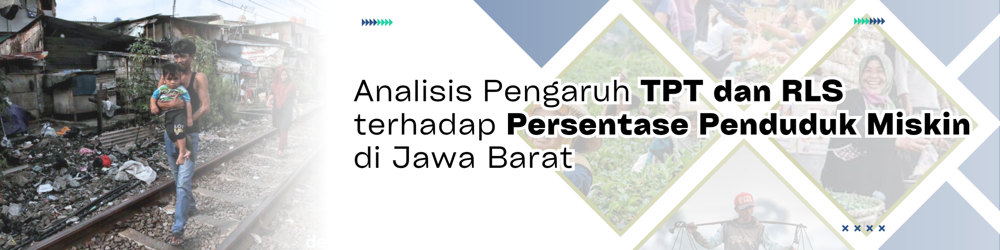

### 📘 **Pendahuluan**

---

Proyek ini merupakan analisis data panel (2021-2024) untuk menguji dampak pengangguran (TPT) dan pendidikan (RLS) terhadap tingkat kemiskinan di 27 kabupaten/kota di Jawa Barat.

### 📖 **Latar Belakang**

---

Jawa Barat menghadirkan suatu anomali. sebagai lumbung industri dan populasi terbesar, **kemiskinan** tetap menjadi **masalah kronis**. Kebijakan publik secara tradisional berfokus pada dua pilar untuk mengatasinya, yaitu menurunkan **Tingkat Pengangguran Terbuka (TPT)** dan **meningkatkan Rata-rata Lama Sekolah (RLS)**. Namun, efektivitas kedua pilar ini dipertanyakan. Fokus pada TPT berisiko mengabaikan fenomena pekerja miskin yang **memiliki pekerjaan** namun **upahnya tidak mencukupi**, sementara fokus pada RLS dihadapkan pada realitas ketidakcocokan struktural di mana **lulusan terdidik tidak selalu terserap oleh pasar kerja yang ada**.

Proyek ini tidak bertujuan untuk membuktikan ulang teori, melainkan untuk menguji efektivitas kuantitatif dari kedua pilar kebijakan tersebut. Dengan menggunakan data panel 2021-2024 dari 27 kabupaten/kota di Jawa Barat, penelitian ini mencari jawaban yang lebih mendalam. Di antara ketersediaan lapangan kerja (TPT) dan kualitas modal manusia (RLS), **pengungkit manakah** yang secara statistik memiliki dampak **paling signifikan** dalam menurunkan **kemiskinan di Jawa Barat** pada periode pemulihan ekonomi saat ini?

### 🎯 **Tujuan Proyek**

---

Berdasarkan latar belakang tersebut, tujuan dari proyek ini adalah:

1. Menganalisis pengaruh **Tingkat Pengangguran Terbuka (TPT)** secara **parsial** terhadap **Persentase Penduduk Miskin (PPM)** di kabupaten/kota Jawa Barat.
2. Menganalisis pengaruh **Rata-Rata Lama Sekolah (RLS)** secara **parsial** terhadap **Persentase Penduduk Miskin (PPM)** di kabupaten/kota Jawa Barat.
3. Menganalisis pengaruh **TPT dan RLS** secara **simultan (bersama-sama)** terhadap **Persentase Penduduk Miskin (PPM)** di kabupaten/kota Jawa Barat.
4. Mengidentifikasi faktor (**antara TPT dan RLS**) yang memiliki pengaruh **paling dominan** terhadap **Persentase Penduduk Miskin (PPM)** di Jawa Barat selama periode 2021-2024.

### 📊 **Data & Variabel**

---

  

  <table style="margin: 0 auto; text-align: left; width: 80%;">
    <tr>
      <!-- Kolom Variabel X -->
      <td style="vertical-align: top; width: 50%; padding-right: 20px;">
        <h4>🔢 <em>Variabel Prediktor (X)</em></h4>
        <ul>
          <li>Tingkat Pengangguran Terbuka (TPT)</li>
          <li>Rata-Rata Lama Sekolah (RLS)</li>
        </ul>
      </td>

      <!-- Kolom Variabel Y -->
      <td style="vertical-align: top; width: 50%; padding-left: 20px;">
        <h4>📈 <em>Variabel Target (Y)</em></h4>
        <ul>
          <li>Persentase Penduduk Miskin (PPM)</li>
        </ul>
      </td>
    </tr>
  </table>

### 📦 **Ruang Lingkup**

---

1. **Cakupan**: Penelitian ini menggunakan **data panel tahunan** yang terdiri dari **27 Kabupaten/Kota di Provinsi Jawa Barat** (sebagai *unit cross-section*) selama periode waktu 2021-2024.

2. **Fokus**: Berfokus pada pemodelan hubungan pengaruh secara langsung antara dua faktor utama (Tingkat Pengangguran Terbuka dan Rata-Rata Lama Sekolah) terhadap Persentase Penduduk Miskin. Analisis mencakup pemilihan model regresi data panel (FEM/REM), pengujian asumsi klasik, dan penerapan koreksi model (*Driscoll-Kraay Standard Errors*) untuk mengukur kekuatan dan arah hubungan.

3. **Batasan**: Penelitian ini tidak mencakup faktor-faktor eksternal lain yang secara teoretis dapat memengaruhi kemiskinan (misalnya, inflasi, Gini Ratio, pertumbuhan PDRB, atau belanja bantuan sosial pemerintah) di luar dua variabel independen yang telah dipilih.

### 🧭 **Metodologi**

---

#### **1. 🧹 Persiapan Data (*Data Wrangling*)**

---

- **Pengumpulan Data**: Mengumpulkan data sekunder data panel (tahunan 2021-2024) dari Badan Pusat Statistik (BPS) Jawa Barat.
- **Cakupan Data**: Data mencakup 3 variabel (`PPM`, `TPT`, `RLS`) untuk 27 Kabupaten/Kota di Jawa Barat (`N=27`, `T=4`, `Total Observasi=108`).
- **Pembersihan & Konsistensi**:

  - Memastikan semua variabel telah diformat sebagai numerik (`<dbl>`) menggunakan `glimpse()`.
  - Menggabungkan (`merge`) dataset yang terpisah menjadi satu data frame panel akhir yang seimbang (*balanced panel*).
  
<figure style="text-align: center;">
  
  <figcaption style="font-size: 14px; font-style: italic; color: rgba(0,0,0,0.7); margin-top: 8px;">
    Gambar 1. Cuplikan Data
  </figcaption>
</figure>

  
#### **2. 🔍 Analisis Data Eksplorasi (EDA)**

---

- **Statistik Deskriptif**: Menggunakan `describeBy()` untuk memahami karakteristik, sebaran (mean, median), dan disparitas data, baik dikelompokkan berdasarkan `Wilayah` (antar kab/kota) maupun `Tahun`.

- **Uji Korelasi Pearson**: Membuat matriks korelasi untuk mengukur kekuatan dan arah hubungan linear awal antar variabel, serta sebagai deteksi dini risiko multikolinearitas.

<figure style="text-align: center;">
  
  <figcaption style="font-size: 14px; font-style: italic; color: rgba(0,0,0,0.7); margin-top: 20px; margin-bottom: 20px;">
    Gambar 2. Heatmap Matriks Korelasi
  </figcaption>
</figure>

  <blockquote style="font-size: 14px; color: rgba(0,0,0,0.85);">
    

      Berdasarkan matriks korelasi, teridentifikasi sebuah 
      <strong>korelasi negatif yang kuat</strong> antara 
      <code>PPM</code> (Kemiskinan) dan <code>RLS</code> (Pendidikan) 
      (<strong>-0.73</strong>), yang mengindikasikan bahwa 
      <strong>pendidikan yang lebih tinggi</strong> sangat terkait dengan 
      <strong>kemiskinan yang lebih rendah</strong>.
    

    

      Namun, hubungan yang lebih kompleks terlihat pada variabel lain. 
      Ditemukan <strong>korelasi negatif yang sangat lemah (-0.18)</strong> 
      antara <code>PPM</code> dan <code>TPT</code> (Pengangguran), yang kemungkinan 
      disebabkan oleh fenomena <em>"pekerja miskin"</em> (*working poor*) 
      yang <strong>tidak terhitung sebagai penganggur (TPT) namun tetap miskin</strong>.
    

    

      Selain itu, <strong>korelasi positif lemah (0.31)</strong> antara 
      <code>TPT</code> dan <code>RLS</code> mengindikasikan adanya 
      <em>mismatch</em> di pasar kerja, di mana 
      <strong>lulusan yang lebih terdidik</strong> mungkin 
      <strong>secara selektif menganggur</strong> sambil menunggu 
      <strong>pekerjaan yang layak</strong>.
    

  </blockquote>

#### **3. 🔧 Pemodelan Regresi Data Panel**

- **Formulasi Model**: Memodelkan `PPM` (Y) sebagai fungsi dari `TPT` (X1) dan `RLS` (X2) menggunakan paket `plm` di R.

  - Model Utama: PPM ~ TPT + RLS

- **Estimasi Model Awal**: Melakukan estimasi pada tiga model dasar regresi data panel untuk perbandingan:

  1. *Common Effect Model* (Pooled OLS)

  2. *Fixed Effect Model* (FEM)

  3. *Random Effect Model* (REM)
  
#### **4. 🧩 Pemilihan Model & Uji Spesifikasi**

- **Pemilihan Model**: Menjalankan serangkaian uji spesifikasi untuk memilih model terbaik:

  1. **Uji Chow (pFtest)**: Memilih antara *Common Effect* vs *Fixed Effect*.

  2. **Uji Lagrange Multiplier (plmtest)**: Memilih antara *Common Effect* vs *Random Effect*.

  3. **Uji Hausman (phtest)**: Memilih antara *Fixed Effect* vs *Random Effect*.

      (Hasil dari uji ini mengarahkan pada pemilihan *Random Effect* Model (REM)).

#### **5. 📐 Validasi Model & Uji Asumsi Klasik** 

- **Diagnostik**: Memvalidasi keandalan statistik model `REM` yang terpilih.

  1. **Multikolinearitas**: Menggunakan `vif()` pada model OLS Pooled (VIF < 10).

  2. **Normalitas Residual**: Menggunakan `shapiro.test()` (p-value > 0.05).

  3. **Heteroskedastisitas**: Menggunakan `bptest()` (p-value > 0.05).

  4. **Autokorelasi**: Menggunakan `pdwtest()` (Durbin-Watson panel) (p-value > 0.05).

  5. **Cross-Sectional Dependence (CSD)**: Menggunakan `pcdtest()` (Pesaran CD) (p-value > 0.05).

#### **6. 🩺 Remediasi Model (Perbaikan Model) **  

- **Diagnosis**: Hasil dari Uji Asumsi (Langkah 5) menunjukkan adanya pelanggaran asumsi **Autokorelasi** dan **Cross-Sectional Dependence (CSD)** yang signifikan.

- **Solusi**: Untuk mengatasi pelanggaran asumsi ganda tersebut, model `REM` standar tidak dapat digunakan. Solusi yang diterapkan adalah menggunakan **Driscoll-Kraay Standard Errors (SCC)**.

- **Penerapan**: Menghitung ulang *Standard Error* dan p-value model REM dengan memanggil `summary(random, vcov = vcovSCC(random))`. Metode ini menghasilkan estimasi koefisien yang *robust* (kebal) terhadap autokorelasi dan CSD.

#### **7. 💡 Interpretasi Model**

- **Interpretasi Hasil**: Menganalisis output `summary()` model yang telah dikoreksi (`robust SCC`) untuk menarik kesimpulan.

  1. **R-squared**: Seberapa kuat model menjelaskan variasi `PPM`.

  2. **Chisq p-value (dari Robust Wald Test)**: Apakah model signifikan secara simultan.

  3. **Coefficients (Estimate & Pr(>|z|))**: Variabel (`TPT` atau `RLS`) mana yang signifikan secara parsial dan bagaimana arah pengaruhnya (positif/negatif).

### 👥 **Tim Penyusun**

---

* Ade Ariyo Yudanto
* Daumi Rahmatika
* Fitri Hayati
* Nurqalbu Abd. Mutalip
* Putri Aqila